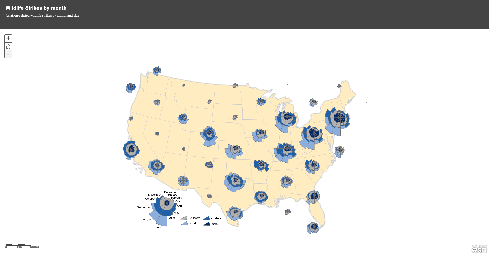
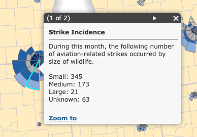
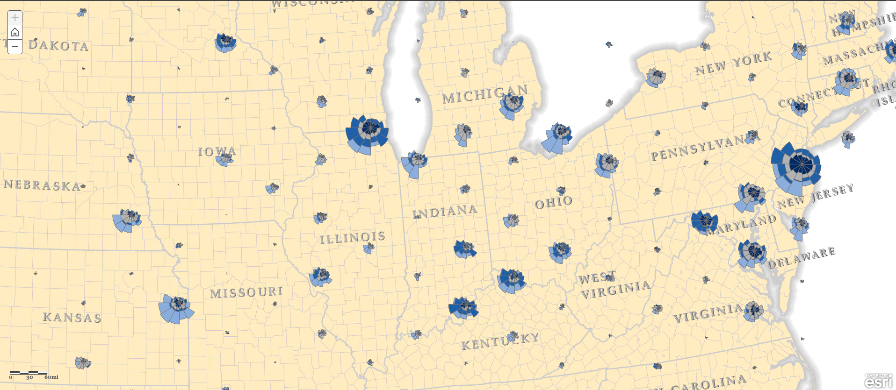
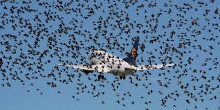

# Web Map Analysis Essay
### On "Bird cs Aircraft by Month" by Ken Field
##### Yihang Sun

#### Introduction
This project is made to present the aviation-related wildlife strikes by month and size which evokes further considerations the causes of high wildlife strikes correlating to the specific months and birth migration based on the size of strikes. A large amount of information is packed and showed into the map. It increases the convenience and efficiency of comparisons among regions in the United States and “distinct seasonal patterns around the country”. The author utilized **coxcombs** which is "a variation of the pie chart where each segment is constructed using equal values but where the radius of the segment differs according to the underlying data magnitude." to *combine the month and size together with equal angels*, which have a better view and understanding for users. The map will **re-sample** as the user **zoom in and out** to provide a detailed information.

#### Function and Targeted Audience
All in all, this web map’s major function is easy for the users to understand the quantity data about the birds versus aircraft by month, and the users are able to tell the spatial pattern like when and where has more airstrikes in the Untied States quickly. The targeting audience for the web map is *everyone* to let people aware the bird-related airstrikes under current technology development. It also targets the *governmental departments of air traffic control* like Federal Aviation Administration and USDA (United States Department of Agriculture) Animal and Plant Health Inspection Service Department to promote a solution and further protection measures about the both safeties of wildlife and aircrafts with passengers. The map is very straightforward and interactive, which allows the users enjoy very much.

#### Author

The map author is **Ken Field** who is introduced as `“professional cartonerd, amateur drummer and snowboarder. Lifetime encourager of cartographic quality not quantity. Map with the times while building on the past.”` Ken has a bachelors in cartography and a PhD in GIS and health geography. “He is author of the best-selling book CARTOGRAPHY and recently taught a MOOC on cartography to over 110,000 people interested in making better maps.” “He's a former academic from the UK but, since 2011, he talks and writes about cartography, teaches and occasionally makes maps, with Esri, in far sunnier climes.” Currently, he is the Chair of the ICA Map Design Commission [Map Design Website](mapdesign.icaci.org). He is the former and a good teacher in map making. Ken is not limited to the traditional map and ethical rules. He encourages everyone to seek their way of making maps.

#### Project Analysis
The system architecture has external internet and internal network. **External internet** is the web pages and browser that directly interact with the users. The web client for this web map is ArcGIS Desktop, ArcGIS Online, Story Map Basic App. It contains interactive components, base map, thematic layer and coxcombs for time periods. The **internal network** contains web server which is the web host, HTTP Server, geospatial server and database server. The service is shown Birdstrike coxcombs popups (FeatureServer) in ArcGIS. The map’s database and data source is from **FAA (Federal Aviation Administration)** [FAA Website](https://www.faa.gov/). Data stored in the database which are free to download in FAA websites.
* **Network following**

The client shows several coxcombs, legends, and a scale. When the user clicks on each coxcomb by month, the client initiates the action and send the request to the web server to geospatial server and ask for the statistics about the wildlife strikes by size based on the selected month from the both file and database server, and send them back to the web popup window. The user can click on the Zoom to button which ask the server the re-sample the data, more coxcomb, and new geospatial information from both database to present a new web map. Same idea with using zoom in and out the map, the servers are doing the same thing fetching the geospatial data for the base map and quantitive data for the thematic layer. 

* **Library and data sources**
The major libraries in use is arcgis which creates map component to display information in different map type and sections in a web map and arcgis for desktop with `GPK` to build on the coxcombs. Furthermore, the author utilized digit library from `dojo` which provided widgets and functionality. He has used `digit/layout/ContentPane` which creates the most basic layout tile. The web map supports responsive design on various devices with different sizes. It functions the same and presents normally just like on the desktop. The data sources contain both vectors and rasters. Each coxcomb is a raster, tilelayer, which source is `https://tiles.arcgis.com/tiles/RS8mqPfEEjgYh6uG/arcgis/rest/services/Birdstrike_coxcombsNEW/MapServer/tile`. The data of coxcomb is from the geojson as vectors.

* **Pros and Cons**

The overall map design is very *simple and straightforward*. To make users focus on the coxcomb more, he utilized boundary basemap with state names only. Although it shows the exact location within the states, it will be better to show the city name or mention it in the *pop-up windows* to have a better analysis. The author designed a home button between the zoom in and out button to allow users to reset the map canvas. The minimum zoom level is too small to view the small coxcomb; some of them are like dots. And there is no attribution mentioned at the bottom to appreciate their helps. However, I think it is good to have the major wildlife strikes shown in the pre-set map to allow users to have a quick analysis, but some of the coxcombs are off the states which is not quite accurate.  *The web map has scalar bar, legend, zoom in, out, and home widgets.* But it doesn’t have the *north arrow* which is not following the basic map rules. The interaction is zoom, home which set the map back to the center, selecting coxcombs, and zoom to the state by clicking the button in the popup window. Overall, the strength of the map is straightforward and easy to analysis for a board conclusion. But the weakness is hard to get to details and deeper analysis.

#### Social Theories
This project is showing the wildlife strikes by month. When we are looking at the months, we can conclude that most of the strikes happened during June, July, and August, because the length of the bars that represent these three months are generally the longest among most of the coxcombs. The length of the bars equals to the total strikes happened to all sizes. Therefore, the users can develop an idea that strikes are relating to specific months, especially in June, July, and August. And December, January, February, and March have less aviation-related wildlife strikes. When we say aviation, we assume that the increase of frequency of flights is proportional to the air strikes. The coxcombs continue proving that from June to August is the summer break for the children which the family tends to travel around. Therefore, **increase of flights raises the wildlife strikes**. Furthermore, the size of the coxcombs tells the estimated total wildlife strikes within the states. We can tell that East has more bigger coxcombs, and I predict **the major cities like New York and Washington has more flights which causes more strike events**. Because the map is not showing the exact city that coxcombs stay, the analysis has low internal validity. Furthermore, I assume **the wildlife strikes is relating to the bird migration pattern**. Birds migrate for food supply and warm temperature. The winter comes, birds migrate to the South, and go back when Spring is here. And the birds migrate together as a large group, therefore, we should look at the large size in the coxcomb which is the darkest blue. As we compare the large size sections of coxcomb at the North and the South, the observation is during the winter months, November to February, the large size wildlife strikes rate to overall strikes in South is higher than the large size wildlife strikes rate comparing to overall number in North, and they decrease in the South to North comparison during the summer period since the birds migrate back to the North as groups.

Therefore, the aviation-related wildlife strikes are correlating to the bird’s migration patterns, travel months, and major cities, which are shown from the sizes of birds strikes relating to months, total lengths of each bar, and size of the coxcomb in the specific location. The information within the map shows the importance for people to consider whether technology development has causational relationship with the safety and health of wildlife. When the world is more developed, the aviation is more demanded, the nature is destroyed by humans gradually. Therefore, the associate departments should come up with particular plans to solve the problem and save this wildlife from strikes. And people today should also consider replacing the aviation-related travel method by other safer transportation to the nature and animals.

As I watched a movie that is saying a wildlife strike happened to an airplane with passengers, the front window broke from the crash. During the high pressure and air speed, the pilots are hard to continue driving the plane. Therefore, the wildlife strike is very dangerous to humans. It can grab many people’s lives. People and government should pay more attention to these events and figure out solutions to better prevent and reduce aviation-related wildlife strikes to happen.
